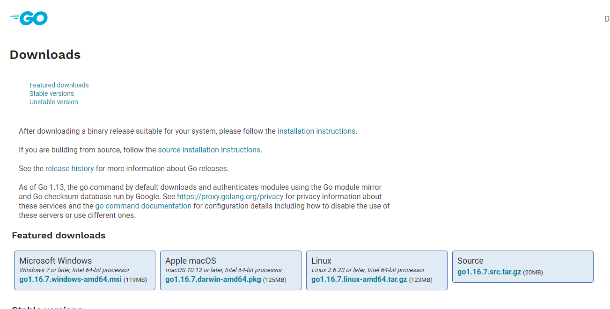
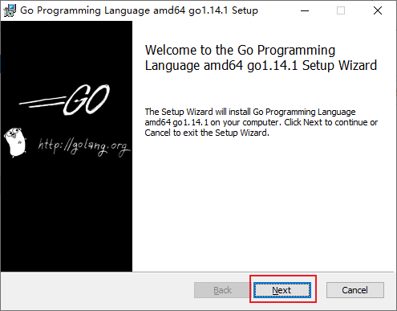
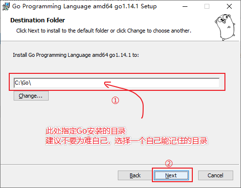
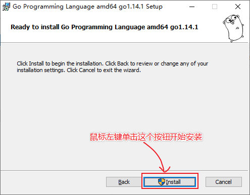
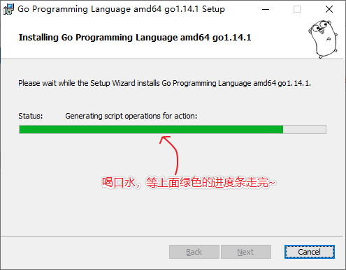
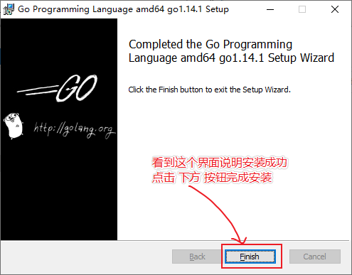
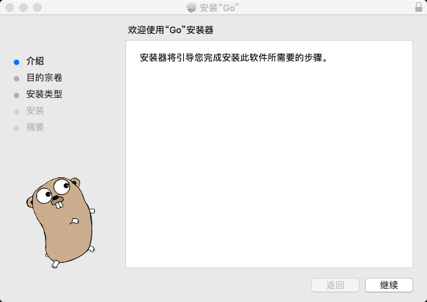
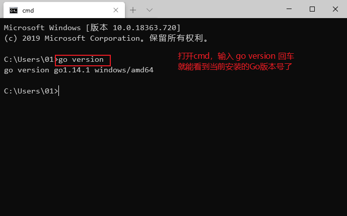

# Go语言开发环境构建

# 摘要
本博文将详细的介绍的在window linux Macos系统下配置的go语言的开发环境，同时设置的Goland的开发设置。同时进行的hello world的测试程序

# 一、版本的选择

Windows平台和Mac平台推荐下载可执行文件版，Linux平台下载压缩文件版。下图中的版本号可能并不是最新的，但总体来说安装教程是类似的。Go语言更新迭代比较快，推荐使用较新版本，体验最新特性。



# 二、安装

## 2.1 Windows安装

此安装实例以 64位Win10系统安装 Go1.14.1可执行文件版本为例。


双击下载好的文件，然后按照下图的步骤安装即可。











## 2.2 Linux下安装

如果不是要在Linux平台敲go代码就不需要在Linux平台安装Go，我们开发机上写好的go代码只需要跨平台编译（详见文章末尾的跨平台编译）好之后就可以拷贝到Linux服务器上运行了，这也是go程序跨平台易部署的优势。

我们在版本选择页面选择并下载好`go1.14.1.linux-amd64.tar.gz`文件：

```shell
wget https://dl.google.com/go/go1.14.1.linux-amd64.tar.gz
```

将下载好的文件解压到/usr/local目录下：

```shell
tar -zxvf go1.14.1.linux-amd64.tar.gz -C /usr/local  # 解压
``` 

如果提示没有权限，加上sudo以root用户的身份再运行。执行完就可以在`/usr/local/`下看到go目录了。

配置环境变量： Linux下有两个文件可以配置环境变量，其中`/etc/profile`是对所有用户生效的；`$HOME/.profile`是对当前用户生效的，
根据自己的情况自行选择一个文件打开，添加如下两行代码，保存退出。

```shell
export GOROOT=/usr/local/go
export PATH=$PATH:$GOROOT/bin
```

修改`/etc/profile`后要重启生效，修改`$HOME/.profile`后使用source命令加载`$HOME/.profile`文件即可生效。 检查：

```go
~ go version
go version go1.14.1 linux/amd64
```

## 2.3 Mac下安装

下载可执行文件版，直接点击下一步安装即可，默认会将go安装到/usr/local/go目录下。



## 检查

上一步安装过程执行完毕后，可以打开终端窗口，输入go version命令，查看安装的Go版本。



# 三、Go命令

## 3.1 GOROOT和GOPATH

GOROOT和GOPATH都是环境变量，其中GOROOT是我们安装go开发包的路径，而从Go 1.8版本开始，Go开发包在安装完成后会为GOPATH设置一个默认目录，
并且在Go1.14及之后的版本中启用了Go Module模式之后，不一定非要将代码写到GOPATH目录下，所以也就不需要我们再自己配置GOPATH了，使用默认的即可。

## 3.2 GOPROXY 非常重要

Go1.14版本之后，都推荐使用go mod模式来管理依赖环境了，也不再强制我们把代码必须写在GOPATH下面的src目录了，你可以在你电脑的任意位置编写go代码。（网上有些教程适用于1.11版本之前。）

默认GoPROXY配置是：`GOPROXY=https://proxy.golang.org,direct`，由于国内访问不到`https://proxy.golang.org`，所以我们需要换一个PROXY，
这里推荐使用`https://goproxy.io`或`https://goproxy.cn`。 可以执行下面的命令修改GOPROXY：

```go
go env -w GOPROXY=https://goproxy.cn,direct
# window 需要在powershell 执行
$env:GOPROXY = "https://proxy.golang.com.cn,direct"
```

# 四、Go程序测试

## 4.1 Hello World

现在我们来创建第一个Go项目——hello。在我们桌面创建一个hello目录。

## 4.2 go mod init
使用go module模式新建项目时，我们需要通过go mod init 项目名命令对项目进行初始化，该命令会在项目根目录下生成go.mod文件。
例如，我们使用hello作为我们第一个Go项目的名称，执行如下命令。

```go
go mod init hello
```

## 4.3 编写代码
接下来在该目录中创建一个main.go文件：

```go
package main  // 声明 main 包，表明当前是一个可执行程序

import "fmt"  // 导入内置 fmt 包

func main(){  // main函数，是程序执行的入口
	fmt.Println("Hello World!")  // 在终端打印 Hello World!
}
```

非常重要！！！ 如果此时VS Code右下角弹出提示让你安装插件，务必点 install all 进行安装。

## 4.4 编译

go build命令表示将源代码编译成可执行文件。

在hello目录下执行：
```go
go build
``` 

或者在其他目录执行以下命令：
```go
go build hello
```

go编译器会去 GOPATH的src目录下查找你要编译的hello项目
编译得到的可执行文件会保存在执行编译命令的当前目录下，如果是windows平台会在当前目录下找到hello.exe可执行文件。
可在终端直接执行该hello.exe文件：

```shell
c:\desktop\hello>hello.exe
Hello World!
```

我们还可以使用-o参数来指定编译后得到的可执行文件的名字。

```go
go build -o heiheihei.exe
```

go run main.go也可以执行程序，该命令本质上也是先编译再执行。

go install表示安装的意思，它先编译源代码得到可执行文件，然后将可执行文件移动到GOPATH的bin目录下。因为我们的环境变量中配置了GOPATH下的bin目录，
所以我们就可以在任意地方直接执行可执行文件了。

## 4.5 跨平台编译

默认我们go build的可执行文件都是当前操作系统可执行的文件，如果我想在windows下编译一个linux下可执行文件，那需要怎么做呢？

只需要指定目标操作系统的平台和处理器架构即可，例如Windows平台cmd下按如下方式指定环境变量。

```shell
SET CGO_ENABLED=0  // 禁用CGO
SET GOOS=linux  // 目标平台是linux
SET GOARCH=amd64  // 目标处理器架构是amd64
```
注意：如果你使用的是PowerShell终端，那么设置环境变量的语法为$ENV:CGO_ENABLED=0。

然后再执行go build命令，得到的就是能够在Linux平台运行的可执行文件了。

Mac 下编译 Linux 和 Windows平台 64位 可执行程序：

```shell
CGO_ENABLED=0 GOOS=linux GOARCH=amd64 go build
CGO_ENABLED=0 GOOS=windows GOARCH=amd64 go build
```

Linux 下编译 Mac 和 Windows 平台64位可执行程序：

```shell
CGO_ENABLED=0 GOOS=darwin GOARCH=amd64 go build
CGO_ENABLED=0 GOOS=windows GOARCH=amd64 go build
```

Windows下编译Mac平台64位可执行程序：

```shell
SET CGO_ENABLED=0
SET GOOS=darwin
SET GOARCH=amd64
go build
```

现在，开启你的Go语言学习之旅吧。人生苦短，let’s Go

# 博文参考